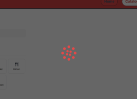

Camper Rent Application

## :dart:Overview

This project is created as part of a technical assignment for a company.  
This is an application for a company that provides camper rentals.

The application consists of three main pages:

- `Home Page` General description of the company's services.
- `Catalog Page` Catalog of campers with filtering options by location,
  equipment, and type.
- `Favorites Page` List of user-added favorite ads.

## :star:Features

- Ad Card: Users can add/remove ads to/from favorites and view detailed camper
  information in a modal.
- Pagination: Displays 4 ads per page, with a "Load more" button for additional
  ads.
- Persistent Favorites: Favorites are saved in local storage to persist across
  page refreshes.
- Filtering: Users can filter campers by location, equipment, and type.

## :computer:Technical Stack:

 
 

**:large_blue_diamond:Front-end** 

 
 

 
 

**:large_blue_diamond:Back-end** 

<a href="https://mockapi.io" target="_blank" rel="noreferrer">MockAPI</a> for
development

 
 

- Loading Spinner:
  <a href="https://mhnpd.github.io/react-loader-spinner/" target="_blank" rel="noreferrer">react-loader-spinner</a>

  

- Styling: Custom
  
  and
  <a href="https://github.com/sindresorhus/modern-normalize" target="_blank" rel="noreferrer">modern-normalize</a>
     
